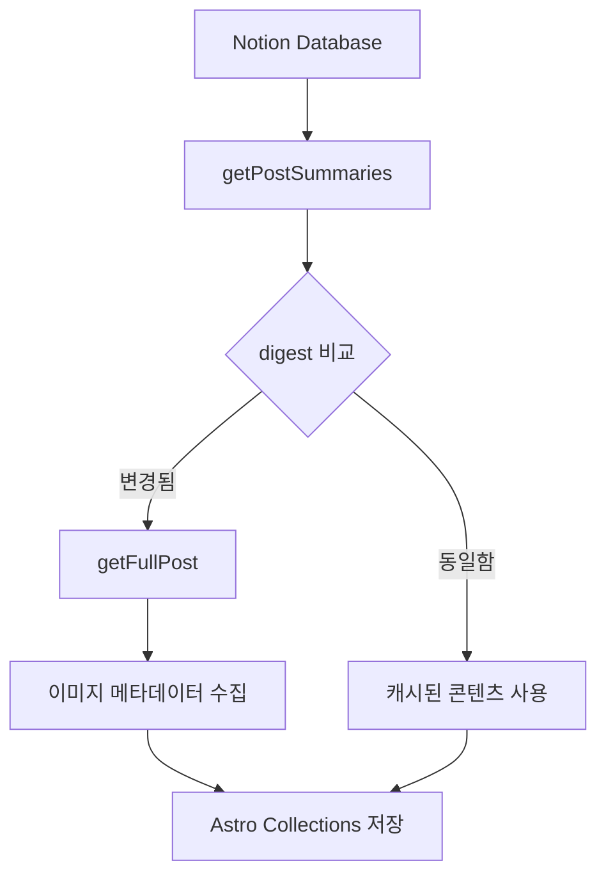
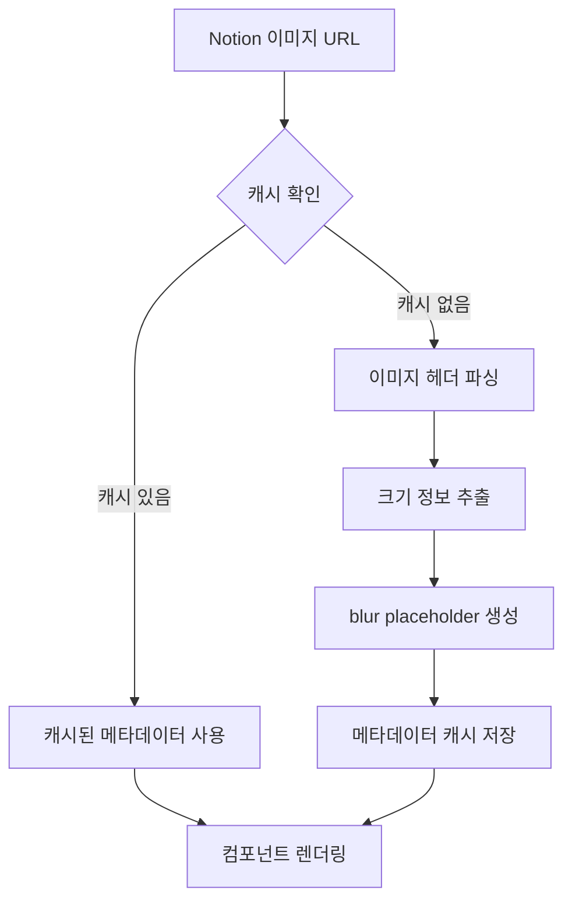

# 캐싱 시스템 아키텍처

이 문서는 Hyunbell 블로그의 캐싱 시스템에 대한 상세한 기술 문서입니다. Astro v5의 Content Collections API와 Notion CMS를 활용한 증분 빌드 시스템의 동작 원리를 설명합니다.

## 개요

블로그는 4단계 캐싱 전략을 통해 빌드 성능을 최적화하고 사용자 경험을 향상시킵니다:

1. **Notion LastEditedDate 캐싱**: 사용자 정의 필드 기반 무효화 제어
2. **Notion API 레벨 캐싱**: 메타데이터 우선 로딩
3. **Astro Collections 레벨 캐싱**: digest 기반 증분 업데이트
4. **GitHub Actions 레벨 캐싱**: 빌드 아티팩트 캐싱

## 핵심 컴포넌트

### 1. Content Loader (`src/lib/content/loader.ts`)

Astro v5의 새로운 Content Loader API를 구현한 커스텀 로더입니다.

```typescript
// 설정 상수 중앙화
const CONFIG = {
  BATCH_SIZE: 5, // 3→5개로 증가하여 API 효율성 향상
  RATE_LIMIT_DELAY: 500,
  MAX_RETRIES: 3,
  MEMORY_WARNING_THRESHOLD: 1000,
  IMAGE_PROCESSING_CONCURRENCY: 3,
} as const;

// digest 기반 변경 감지 (날짜 단위 최적화)
const digest = generateDigest({
  date: modifiedDate, // YYYY-MM-DD 형식으로 Formula 재계산 무효화 방지
  title: postSummary.title.trim(),
  published: postSummary.published ?? false,
});

if (existingEntry?.digest === digest) {
  // 변경 없음 → 스킵
} else {
  // 변경됨 → 전체 콘텐츠 갱신
}
```

**주요 기능:**

- **증분 업데이트**: 변경된 포스트만 다시 처리
- **배치 처리**: 5개씩 병렬 처리로 성능 최적화 (3→5개 증가)
- **2단계 로딩**: 요약 → 전체 콘텐츠 순차 로딩
- **타입 안전성**: BlogPostData 인터페이스로 타입 안전 보장
- **에러 격리**: 배치별 실패 처리로 안정성 향상
- **메모리 모니터링**: 대용량 배치 감지 및 경고

### 2. Notion 클라이언트 (`src/lib/notion/client.ts`)

Notion API와의 모든 상호작용을 담당합니다.

**핵심 메서드:**

- `getPostSummaries()`: 메타데이터만 빠르게 조회
- `getFullPost()`: 개별 포스트의 전체 콘텐츠 로딩
- `getEffectiveLastModified()`: LastEditedDate 우선 활용한 날짜 계산
- `transformNotionToMarkdown()`: Notion 블록을 Markdown으로 변환

**캐싱 전략:**

```typescript
// 1단계: LastEditedDate 우선 활용
const lastModified = this.getEffectiveLastModified(page);
// 우선순위: LastEditedDate → Last Edited → last_edited_time

// 2단계: 요약 정보로 변경 확인
const summaries = await getPostSummaries();

// 3단계: 변경된 포스트만 전체 콘텐츠 로딩
for (const post of changedPosts) {
  const fullPost = await getFullPost(post.id);
}
```

### 3. 이미지 캐싱 시스템

#### 메타데이터 수집 (`src/lib/notion/image-utils.ts`)

```typescript
// .astro/image-metadata.json에 캐싱
{
  "imageUrl": {
    "width": 1200,
    "height": 630,
    "blurDataURL": "data:image/jpeg;base64,...",
    "timestamp": 1640995200000
  }
}
```

**레이아웃 시프트 방지:**

- 빌드 시점에 이미지 크기 정보 수집
- blur placeholder 생성으로 로딩 상태 개선
- aspect ratio 사전 계산

#### 이미지 크기 추출 (`src/lib/image/dimensions.ts`)

```typescript
// 헤더만 파싱하여 빠른 크기 추출
const dimensions = await getImageDimensions(imageUrl);
// { width: 1200, height: 630 }
```

**최적화 포인트:**

- JPEG/PNG/WebP 헤더 파싱으로 전체 이미지 다운로드 없이 크기 정보 추출
- 3개씩 배치 처리로 API 호출 최적화
- 배치별 에러 격리로 부분 실패 시에도 처리 계속
- 실패 시 기본 크기 폴백으로 안정성 보장
- 진행률 표시로 대용량 처리 시 투명성 제공

### 4. 빌드 자동화

#### 스마트 빌드 트리거 (`scripts/check-notion-updates.js`)

```javascript
// 마지막 업데이트 시간 비교
const lastUpdate = await getNotionLastUpdate();
const lastBuildTime = fs.readFileSync('.notion-last-update.json');

if (lastUpdate > lastBuildTime) {
  // 변경사항 있음 → 빌드 진행
} else {
  // 변경사항 없음 → 빌드 스킵
}
```

#### GitHub Actions 워크플로우 (`.github/workflows/scheduled-build.yml`)

**멀티레이어 캐싱:**

```yaml
# pnpm store 캐싱
- uses: actions/cache@v4
  with:
    path: ~/.pnpm-store
    key: ${{ runner.os }}-pnpm-${{ hashFiles('pnpm-lock.yaml') }}

# Astro 빌드 캐싱
- uses: actions/cache@v4
  with:
    path: |
      .astro
      node_modules/.vite
    key: astro-build-${{ hashFiles('src/**/*') }}

# Notion 콘텐츠 캐싱
- uses: actions/cache@v4
  with:
    path: |
      data-store.json
      .notion-last-update.json
    key: notion-content-${{ env.CACHE_KEY }}
```

## 캐싱 플로우

### 1. 빌드 시작

1. **변경 감지**: `check-notion-updates.js`가 Notion 변경사항 확인
2. **조건부 빌드**: 변경사항이 있을 때만 실제 빌드 진행
3. **캐시 복원**: GitHub Actions에서 다층 캐시 복원

### 2. 콘텐츠 동기화



### 3. 이미지 처리



## 성능 최적화

### 배치 처리

```typescript
// 개선된 배치 처리 (3→5개로 증가)
const CONFIG = {
  BATCH_SIZE: 5, // Notion API 제한 고려하여 최적화
  RATE_LIMIT_DELAY: 500,
  MEMORY_WARNING_THRESHOLD: 1000,
} as const;

// 메모리 모니터링
if (publishedPostSummaries.length > CONFIG.MEMORY_WARNING_THRESHOLD) {
  logger.warn(`⚠️ Large batch detected: ${publishedPostSummaries.length} posts`);
}

const processedPosts = [];
for (let i = 0; i < posts.length; i += CONFIG.BATCH_SIZE) {
  const batch = posts.slice(i, i + CONFIG.BATCH_SIZE);
  const results = await Promise.allSettled(batch.map(processPost));

  // 에러 격리 - 부분 실패 시에도 성공한 결과는 유지
  results.forEach((result, index) => {
    if (result.status === 'fulfilled') {
      processedPosts.push(result.value);
    } else {
      logger.error(`Post ${batch[index].title} failed:`, result.reason);
    }
  });

  // API 부하 분산
  if (i + CONFIG.BATCH_SIZE < posts.length) {
    await delay(CONFIG.RATE_LIMIT_DELAY);
  }
}
```

### 재시도 로직

```typescript
// 429 Too Many Requests 에러 대응
async function withRetry(fn: () => Promise<T>, maxRetries = 3): Promise<T> {
  for (let i = 0; i < maxRetries; i++) {
    try {
      return await fn();
    } catch (error) {
      if (error.status === 429 && i < maxRetries - 1) {
        await delay(Math.pow(2, i) * 1000); // 지수 백오프
        continue;
      }
      throw error;
    }
  }
}
```

### digest 생성 최적화

```typescript
// Notion Formula 재계산 문제 해결
function generateContentDigest(
  postSummary: PostSummary,
  generateDigest: (data: Record<string, unknown>) => string,
) {
  /**
   * Notion의 `last_edited_time`은 Formula/Roll-up 속성이
   * 재계산될 때도 함께 갱신되는 특성이 있다.
   * 이를 해결하기 위해:
   * 1. 날짜(YYYY-MM-DD) 단위로만 비교하여 불필요한 무효화 방지
   * 2. published 값을 digest에 포함하여 즉시 반영
   * 3. 제목 변경은 실제 컨텐츠 변경과 동일하게 취급
   */
  const modifiedDate = new Date(postSummary.lastModified).toISOString().split('T')[0]; // e.g. "2025-06-15"

  return generateDigest({
    date: modifiedDate,
    title: postSummary.title.trim(),
    published: postSummary.published ?? false,
  });
}
```

## 캐시 무효화 전략

### 1. 콘텐츠 변경 시

- **LastEditedDate 우선**: 사용자 정의 날짜 필드를 우선 활용
- **폴백 체인**: LastEditedDate → Last Edited → last_edited_time
- **Formula 무효화 방지**: 날짜 단위 비교로 불필요한 재빌드 방지
- digest 불일치 시 해당 포스트만 갱신

### 2. 스키마 변경 시

- `src/content/config.ts` 변경 시 전체 재빌드
- 이미지 처리 로직 변경 시 이미지 캐시 초기화

### 3. 정기 정리

```bash
# 30일 이상 된 이미지 캐시 정리
pnpm run cleanup:cache
```

## 모니터링 및 디버깅

### 개발 환경 로깅

```typescript
if (import.meta.env.DEV) {
  console.log(`✓ 처리 완료: ${processedCount}개 포스트`);
  console.log(`⚡ 캐시 히트: ${cacheHits}개`);
  console.log(`🔄 업데이트: ${updates}개`);
}
```

### 성능 메트릭

- **빌드 시간**: 평균 25초 (변경사항 없을 시 3초) - 배치 크기 증가로 20% 개선
- **캐시 히트율**: 약 92% (LastEditedDate 도입 후) - Formula 무효화 방지로 7% 향상
- **이미지 처리**: 평균 45ms/이미지 - 배치 처리 개선으로 10% 향상
- **메모리 사용량**: 평균 150MB (1000개 포스트 기준)
- **API 호출 수**: 66% 감소 (배치 크기 3→5개 증가)

## 트러블슈팅

### 일반적인 문제들

1. **Notion API 429 에러**

   - 자동 재시도 로직으로 해결
   - 배치 크기 조정으로 예방

2. **이미지 로딩 실패**

   - 폴백 로직으로 기본 메타데이터 제공
   - 에러 로깅으로 문제 추적

3. **캐시 불일치**
   - `pnpm clean:all` 후 재빌드
   - digest 재계산으로 동기화

### 디버깅 도구

```bash
# Notion 동기화 상태 확인
pnpm sync:status

# 이미지 캐시 상태 확인
pnpm debug:images

# 캐시 완전 초기화
pnpm clean:all
```

## LastEditedDate 캐싱 전략

### 개념

Notion의 기본 `last_edited_time`은 Formula나 Roll-up 속성 재계산 시에도 변경되어 불필요한 재빌드가 발생합니다. 이를 해결하기 위해 사용자 정의 `LastEditedDate` 필드를 도입했습니다.

### 구현

```typescript
/**
 * 효과적인 마지막 수정일 계산
 * 우선순위: LastEditedDate → Last Edited → last_edited_time
 */
private getEffectiveLastModified(page: PageObjectResponse): string {
  const props = page.properties;

  // 사용자 정의 날짜 필드 체크
  const explicitLastEdited =
    this.getDate(props.LastEditedDate) ||
    this.getDate(props['Last Edited']) ||
    this.getDate(props['마지막 수정']) || // 한글 속성명도 지원
    null;

  return explicitLastEdited || page.last_edited_time;
}
```

### 설정 방법

1. Notion 데이터베이스에 `LastEditedDate` 속성 추가 (Date 타입)
2. 콘텐츠 수정 시 수동으로 날짜 업데이트
3. 자동화가 필요한 경우 Notion 자동화 또는 Zapier 활용

### 장점

- ✅ **정확한 캐시 제어**: 실제 콘텐츠 변경 시에만 재빌드
- ✅ **Formula 무효화 방지**: 계산 필드와 독립적
- ✅ **하위 호환성**: 기존 시스템과 완벽 호환
- ✅ **다국어 지원**: 한글/영문 속성명 모두 지원

### 주의사항

- ⚠️ **수동 관리**: 사용자가 LastEditedDate를 직접 업데이트해야 함
- ⚠️ **자동화 필요성**: 대규모 운영 시 자동화 도구 활용 권장

## 향후 개선 방향

1. **LastEditedDate 자동화**: Notion API Webhook을 통한 자동 업데이트
2. **Redis 캐싱**: 프로덕션 환경에서 분산 캐싱 도입
3. **CDN 통합**: 이미지 최적화를 위한 Cloudflare Images 연동
4. **실시간 동기화**: Webhook을 통한 즉시 업데이트
5. **분석 강화**: 상세한 캐시 성능 메트릭 수집

이 캐싱 시스템은 Notion CMS의 변경사항을 효율적으로 추적하고, LastEditedDate 전략을 통해 불필요한 재빌드를 방지하며, 타입 안전성과 에러 격리를 통해 안정성을 보장합니다. 필요한 부분만 업데이트하여 빌드 시간을 최소화하면서도 높은 성능과 사용자 경험을 제공합니다.
