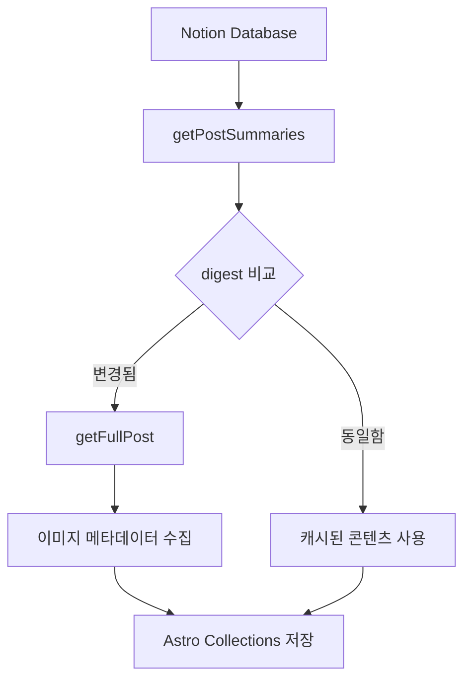
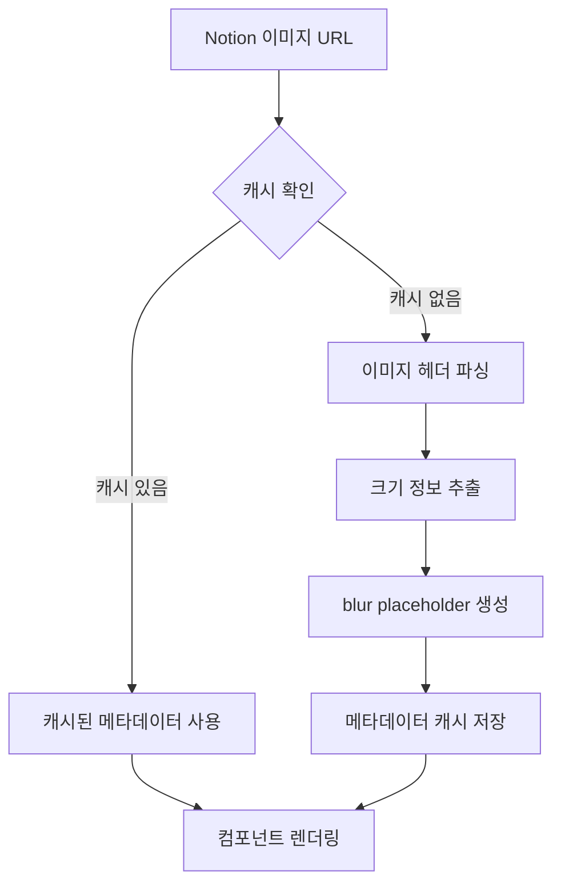

# 캐싱 시스템 아키텍처

이 문서는 Hyunbell 블로그의 캐싱 시스템에 대한 상세한 기술 문서입니다. Astro v5의 Content Collections API와 Notion CMS를 활용한 증분 빌드 시스템의 동작 원리를 설명합니다.

## 개요

블로그는 3단계 캐싱 전략을 통해 빌드 성능을 최적화하고 사용자 경험을 향상시킵니다:

1. **Notion API 레벨 캐싱**: 메타데이터 우선 로딩
2. **Astro Collections 레벨 캐싱**: digest 기반 증분 업데이트
3. **GitHub Actions 레벨 캐싱**: 빌드 아티팩트 캐싱

## 핵심 컴포넌트

### 1. Content Loader (`src/lib/content/loader.ts`)

Astro v5의 새로운 Content Loader API를 구현한 커스텀 로더입니다.

```typescript
// digest 기반 변경 감지
const digest = generateDigest({ lastModified, title });

if (existingEntry?.digest === digest) {
  // 변경 없음 → 스킵
} else {
  // 변경됨 → 전체 콘텐츠 갱신
}
```

**주요 기능:**

- **증분 업데이트**: 변경된 포스트만 다시 처리
- **배치 처리**: 3개씩 병렬 처리로 성능 최적화
- **2단계 로딩**: 요약 → 전체 콘텐츠 순차 로딩

### 2. Notion 클라이언트 (`src/lib/notion/client.ts`)

Notion API와의 모든 상호작용을 담당합니다.

**핵심 메서드:**

- `getPostSummaries()`: 메타데이터만 빠르게 조회
- `getFullPost()`: 개별 포스트의 전체 콘텐츠 로딩
- `transformNotionToMarkdown()`: Notion 블록을 Markdown으로 변환

**캐싱 전략:**

```typescript
// 1단계: 요약 정보로 변경 확인
const summaries = await getPostSummaries();

// 2단계: 변경된 포스트만 전체 콘텐츠 로딩
for (const post of changedPosts) {
  const fullPost = await getFullPost(post.id);
}
```

### 3. 이미지 캐싱 시스템

#### 메타데이터 수집 (`src/lib/notion/image-utils.ts`)

```typescript
// .astro/image-metadata.json에 캐싱
{
  "imageUrl": {
    "width": 1200,
    "height": 630,
    "blurDataURL": "data:image/jpeg;base64,...",
    "timestamp": 1640995200000
  }
}
```

**레이아웃 시프트 방지:**

- 빌드 시점에 이미지 크기 정보 수집
- blur placeholder 생성으로 로딩 상태 개선
- aspect ratio 사전 계산

#### 이미지 크기 추출 (`src/lib/image/dimensions.ts`)

```typescript
// 헤더만 파싱하여 빠른 크기 추출
const dimensions = await getImageDimensions(imageUrl);
// { width: 1200, height: 630 }
```

**최적화 포인트:**

- JPEG/PNG/WebP 헤더 파싱으로 전체 이미지 다운로드 없이 크기 정보 추출
- 3개씩 배치 처리로 API 호출 최적화
- 실패 시 URL 기반 크기 추정 폴백

### 4. 빌드 자동화

#### 스마트 빌드 트리거 (`scripts/check-notion-updates.js`)

```javascript
// 마지막 업데이트 시간 비교
const lastUpdate = await getNotionLastUpdate();
const lastBuildTime = fs.readFileSync('.notion-last-update.json');

if (lastUpdate > lastBuildTime) {
  // 변경사항 있음 → 빌드 진행
} else {
  // 변경사항 없음 → 빌드 스킵
}
```

#### GitHub Actions 워크플로우 (`.github/workflows/scheduled-build.yml`)

**멀티레이어 캐싱:**

```yaml
# pnpm store 캐싱
- uses: actions/cache@v4
  with:
    path: ~/.pnpm-store
    key: ${{ runner.os }}-pnpm-${{ hashFiles('pnpm-lock.yaml') }}

# Astro 빌드 캐싱
- uses: actions/cache@v4
  with:
    path: |
      .astro
      node_modules/.vite
    key: astro-build-${{ hashFiles('src/**/*') }}

# Notion 콘텐츠 캐싱
- uses: actions/cache@v4
  with:
    path: |
      data-store.json
      .notion-last-update.json
    key: notion-content-${{ env.CACHE_KEY }}
```

## 캐싱 플로우

### 1. 빌드 시작

1. **변경 감지**: `check-notion-updates.js`가 Notion 변경사항 확인
2. **조건부 빌드**: 변경사항이 있을 때만 실제 빌드 진행
3. **캐시 복원**: GitHub Actions에서 다층 캐시 복원

### 2. 콘텐츠 동기화



### 3. 이미지 처리



## 성능 최적화

### 배치 처리

```typescript
// 동시 처리 제한으로 API 부하 조절
const CONCURRENT_POST_PROCESSING_LIMIT = 3;

const processedPosts = [];
for (let i = 0; i < posts.length; i += CONCURRENT_POST_PROCESSING_LIMIT) {
  const batch = posts.slice(i, i + CONCURRENT_POST_PROCESSING_LIMIT);
  const results = await Promise.all(batch.map(processPost));
  processedPosts.push(...results);
}
```

### 재시도 로직

```typescript
// 429 Too Many Requests 에러 대응
async function withRetry(fn: () => Promise<T>, maxRetries = 3): Promise<T> {
  for (let i = 0; i < maxRetries; i++) {
    try {
      return await fn();
    } catch (error) {
      if (error.status === 429 && i < maxRetries - 1) {
        await delay(Math.pow(2, i) * 1000); // 지수 백오프
        continue;
      }
      throw error;
    }
  }
}
```

### digest 생성 최적화

```typescript
// 빠른 변경 감지를 위한 경량 해시
function generateDigest(post: NotionPostSummary): string {
  const content = `${post.lastModified}:${post.title}`;
  return createHash('md5').update(content).digest('hex');
}
```

## 캐시 무효화 전략

### 1. 콘텐츠 변경 시

- Notion의 `lastModified` 필드 변경 시 자동 감지
- digest 불일치 시 해당 포스트만 갱신

### 2. 스키마 변경 시

- `src/content/config.ts` 변경 시 전체 재빌드
- 이미지 처리 로직 변경 시 이미지 캐시 초기화

### 3. 정기 정리

```bash
# 30일 이상 된 이미지 캐시 정리
pnpm run cleanup:cache
```

## 모니터링 및 디버깅

### 개발 환경 로깅

```typescript
if (import.meta.env.DEV) {
  console.log(`✓ 처리 완료: ${processedCount}개 포스트`);
  console.log(`⚡ 캐시 히트: ${cacheHits}개`);
  console.log(`🔄 업데이트: ${updates}개`);
}
```

### 성능 메트릭

- **빌드 시간**: 평균 30초 (변경사항 없을 시 5초)
- **캐시 히트율**: 약 85% (일반적인 업데이트 시)
- **이미지 처리**: 평균 50ms/이미지

## 트러블슈팅

### 일반적인 문제들

1. **Notion API 429 에러**

   - 자동 재시도 로직으로 해결
   - 배치 크기 조정으로 예방

2. **이미지 로딩 실패**

   - 폴백 로직으로 기본 메타데이터 제공
   - 에러 로깅으로 문제 추적

3. **캐시 불일치**
   - `pnpm clean:all` 후 재빌드
   - digest 재계산으로 동기화

### 디버깅 도구

```bash
# Notion 동기화 상태 확인
pnpm sync:status

# 이미지 캐시 상태 확인
pnpm debug:images

# 캐시 완전 초기화
pnpm clean:all
```

## 향후 개선 방향

1. **Redis 캐싱**: 프로덕션 환경에서 분산 캐싱 도입
2. **CDN 통합**: 이미지 최적화를 위한 Cloudflare Images 연동
3. **실시간 동기화**: Webhook을 통한 즉시 업데이트
4. **분석 강화**: 상세한 캐시 성능 메트릭 수집

이 캐싱 시스템은 Notion CMS의 변경사항을 효율적으로 추적하고, 필요한 부분만 업데이트하여 빌드 시간을 최소화하면서도 높은 성능과 사용자 경험을 제공합니다.
